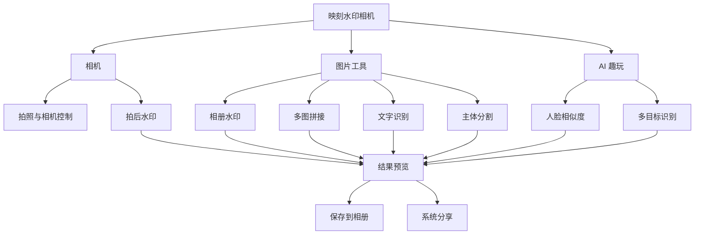
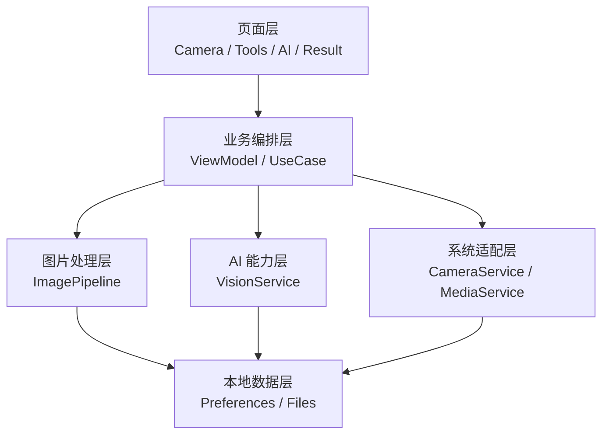

# 映刻水印相机：产品与技术开发文档

> 文档版本：V0.2  
> 更新日期：2026-08-19  
> 项目路径：`E:\Codex-AI-Coding\cameraDemo`  
> 项目阶段：产品规划与首版开发准备  
> 技术方向：HarmonyOS 原生应用、ArkTS、ArkUI、Stage 模型

## 1. 项目概述

### 1.1 应用名称

**映刻水印相机**

建议宣传语：

> 拍下，读懂，再创作。

建议应用市场副标题：

> 拍照水印、智能抠图、拼图与文字识别

### 1.2 产品定位

映刻水印相机是一款以“拍摄 + 图片编辑 + 端侧智能视觉”为核心的一站式鸿蒙影像工具。

应用不仅提供基础拍照能力，还将水印、多图拼接、文字识别、主体分割、人脸相似度和多目标识别整合到统一的图片处理流程中，让用户能够在拍摄或选择照片后直接完成处理、保存和分享。

### 1.3 产品原则

- **本地优先**：照片和 AI 视觉数据尽可能在设备端完成处理。
- **不覆盖原图**：处理结果默认另存为新图片。
- **最小权限**：仅在用户触发相应功能时申请必要权限。
- **无账号起步**：首版不注册、不登录、不做云同步。
- **结果可解释**：无人脸、识别失败、低置信度等情况给出明确提示。
- **性能可控**：对高像素图片、多图数量和最终输出尺寸设置合理限制。

## 2. 当前工程基线

根据项目现有配置，当前工程情况如下：

| 项目 | 当前配置 |
| --- | --- |
| 工程模型 | HarmonyOS Stage 模型 |
| `targetSdkVersion` | `6.1.0(23)` |
| `compatibleSdkVersion` | `6.1.0(23)` |
| `runtimeOS` | `HarmonyOS` |
| 支持设备 | `phone`、`tablet`、`2in1` |
| 当前包名 | `com.example.myapplication`，正式开发前需要修改 |
| 相机权限 | 已声明 `ohos.permission.CAMERA` |
| 网络权限 | 当前未声明，符合纯端侧首版方向 |

正式开发前应完成以下基础配置：

1. 将应用名称统一改为“映刻水印相机”。
2. 确定正式 `bundleName` 和 `vendor`。
3. 替换默认应用图标、启动图标和应用说明。
4. 检查相机权限说明文案是否清晰、符合上架要求。
5. 使用目标真机验证 API 23 下 Camera Kit 和 Core Vision Kit 的实际支持情况。

## 3. 是否需要后端

### 3.1 首版结论

**如果只提供本文规划的功能，映刻水印相机不需要建设自己的业务后端。**

拍照、相册选图、水印、多图拼接、图片编码、文字识别、主体分割、人脸比对、多目标识别、保存和分享都可以通过鸿蒙系统能力及设备端处理完成。

首版数据流程：

```text
拍照或选择照片
    ↓
设备端解码和方向校正
    ↓
本地水印、拼接或 AI 分析
    ↓
本地预览结果
    ↓
用户决定保存或分享
```

### 3.2 首版不需要的服务

- 用户注册和登录服务。
- 服务端数据库。
- 图片上传和云端存储。
- 云端 AI 推理服务。
- 管理后台。
- 自建文件下载服务。
- 云相册和跨设备同步。

### 3.3 未来可能引入后端的需求

如果后续加入下列功能，需要重新评估网络和后端：

- 用户账号、会员体系和多设备数据同步。
- 云相册、图片备份和草稿同步。
- 在线水印模板、字体、贴纸和背景素材。
- 云端 AI、自定义识别模型或服务端人脸处理。
- 作品社区、点赞、评论和关注。
- 运营活动、远程配置和内容推荐。
- 用户反馈时上传图片或诊断日志。
- 订阅付费、权益校验和订单管理。

## 4. 应用信息架构

首页规划为三个主入口：**相机、图片工具、AI 趣玩**。



### 4.1 主入口一：相机

核心定位：直接完成拍摄和水印出片。

首版功能：

- 相机预览。
- 拍照。
- 前后摄像头切换。
- 闪光灯开关。
- 拍摄结果预览。
- 拍后添加预设水印。
- 保存到相册。
- 系统分享。

后续可扩展：

- 点击对焦和双指变焦。
- 网格线。
- 倒计时拍摄。
- 音量键快门。
- 实时水印预览。
- 专业参数设置。

### 4.2 主入口二：图片工具

核心定位：处理用户相册中的已有照片。

首版功能：

- 相册照片添加水印。
- 多张照片纵向拼接。
- 多张照片横向拼接。
- 网格拼图。
- 通用文字识别。
- 主体分割和透明背景导出。
- 纯色或图片换背景。

后续可扩展：

- 图片裁剪和旋转。
- 滤镜和基础调色。
- 自由画布拼贴。
- 贴纸和自定义字体。
- 批量水印。
- 历史记录和草稿箱。

### 4.3 主入口三：AI 趣玩

核心定位：提供轻量、端侧、可分享的智能视觉玩法。

首版功能：

- 两张人物照片的人脸相似度。
- 图片多目标识别。
- 显示类别、区域框和置信度。
- 生成结果分享卡。

产品要求：

- 人脸结果页固定显示“AI 结果仅供娱乐”。
- 不将人脸相似度包装成医学、亲缘、审美或高风险身份结论。
- 无人脸、多张主要人脸或照片质量不足时提示用户重新选择。

## 5. 功能优先级

| 编号 | 功能 | 入口 | 优先级 | 主要鸿蒙能力 |
| --- | --- | --- | --- | --- |
| F01 | 相机预览与拍照 | 相机 | P0 | Camera Kit |
| F02 | 拍后添加预设水印 | 相机 | P0 | Image Kit、ArkGraphics 2D |
| F03 | 相册照片添加水印 | 图片工具 | P0 | PhotoPicker、Image Kit |
| F04 | 多图拼接 | 图片工具 | P0 | PhotoPicker、离屏 Canvas |
| F05 | 保存和分享 | 公共能力 | P0 | Media Library Kit、系统分享 |
| F06 | 通用文字识别 | 图片工具 | P1 | Core Vision Kit `textRecognition` |
| F07 | 主体分割 | 图片工具 | P1 | Core Vision Kit `subjectSegmentation` |
| F08 | 人脸相似度 | AI 趣玩 | P1 | Core Vision Kit `faceComparator` |
| F09 | 多目标识别 | AI 趣玩 | P1 | Core Vision Kit `objectDetection` |
| F10 | 实时水印与高级相机 | 相机 | P2 | Camera Kit、ArkGraphics 2D |

## 6. 详细功能设计

### 6.1 相机拍照

推荐使用 Camera Kit 构建自定义相机。

基本流程：

1. 用户进入相机页面。
2. 检查并申请相机权限。
3. 获取 `CameraManager`。
4. 选择相机设备并创建输入。
5. 创建预览输出和拍照输出。
6. 创建并启动拍照会话。
7. 用户点击快门。
8. 获取拍摄结果并进入结果预览页。
9. 用户选择水印模板、保存或分享。

需要处理的异常：

- 用户拒绝相机权限。
- 相机正在被其他应用占用。
- 相机会话创建失败。
- 应用切换到后台后相机资源被回收。
- 页面销毁时相机没有正确释放。

### 6.2 水印功能

支持两种图片来源：

- 相机刚拍摄的照片。
- 通过系统 PhotoPicker 选择的相册照片。

水印类型：

- 内置 Logo 图片。
- 自定义文字。
- 日期和时间。
- 手机设备信息。
- 地点或经纬度。
- 用户备注。

可调整属性：

- 位置。
- 大小。
- 透明度。
- 颜色。
- 字体。
- 旋转角度。
- 与图片边缘的距离。

推荐处理管线：

```text
获取图片 URI 或拍摄结果
    ↓
读取图片尺寸、格式和 EXIF 方向
    ↓
解码为 PixelMap
    ↓
创建可编辑目标 PixelMap
    ↓
Canvas 绘制原图
    ↓
绘制文字或 Logo 水印
    ↓
ImagePacker 编码
    ↓
保存为新的媒体资源
```

输出要求：

- 默认保留原图。
- 普通照片优先输出 JPEG。
- 需要透明背景时输出 PNG。
- 最终保存结果应与预览保持一致。

### 6.3 多图拼接

用户通过 PhotoPicker 一次选择多张图片，调整顺序和布局后生成新的图片。

首版拼接模式：

- 纵向长图。
- 横向长图。
- 二宫格、四宫格、九宫格。

可调整项目：

- 图片顺序。
- 图片间距。
- 背景颜色。
- 图片比例。
- 边框和圆角。

性能要求：

- 首版建议最多选择 9 张图片。
- 根据最终输出尺寸进行下采样解码。
- 不让所有原始全分辨率 PixelMap 长期驻留内存。
- 大图合成、编码应放在 TaskPool 或 Worker 中执行。
- 对最终总像素数和超长图最长边设置上限。

### 6.4 通用文字识别

使用 Core Vision Kit 的 `textRecognition` 对照片进行 OCR。

适用场景：

- 文档和纸张。
- 收据和票据。
- 名片。
- 应用截图。
- 路牌和印刷文字。

结果功能：

- 展示识别全文。
- 复制全文。
- 分段复制。
- 分享文字。
- 在支持的情况下显示文字区域框。

识别前应进行：

- EXIF 方向校正。
- 合理缩放。
- 可选的识别区域裁剪。
- 避免对源图进行过度压缩。

### 6.5 主体分割

使用 Core Vision Kit 的 `subjectSegmentation` 提取图片中的显著前景主体。

首版输出：

- 透明背景 PNG。
- 白色、蓝色、红色等纯色背景。
- 用户选择的自定义图片背景。

可组合玩法：

- 将分割主体作为拼图贴纸。
- 将文字或水印放到主体后方。
- 对背景添加模糊效果。

能力边界：

- 毛发、透明物体、细小结构可能存在边缘误差。
- 主体与背景颜色接近时可能降低分割质量。
- 主体分割不等于可以精确分割任意指定物体。

### 6.6 人脸相似度

使用 Core Vision Kit 的 `faceComparator` 对两张包含人脸的图片进行比对。

结果可展示：

- `similarity` 相似度或置信度分数。
- `isSamePerson` 是否为同一人的系统判断。

处理要求：

- 每张图片优先只包含一个清晰的主要人脸。
- 推荐使用正脸、无遮挡、光线正常的照片。
- 无人脸或人脸质量不足时不进入结果页。
- 页面退出后及时释放分析器和 PixelMap。
- 不默认持久化人脸特征。
- 不将照片上传到服务器。

固定免责声明：

> AI 人脸相似度仅供娱乐，不作为身份认证、亲缘鉴定或其他专业结论。

### 6.7 多目标识别

使用 Core Vision Kit 的 `objectDetection` 检测图片中的常见物体。

首版展示：

- 识别区域框。
- 物体类别。
- 置信度。
- 识别数量。

能力边界：

- 只能识别官方模型支持的预设类别。
- 不能直接识别企业内部设备、零件或具体商品型号。
- 如果以后需要自定义类别，需要单独评估数据集、模型训练和 MindSpore Lite 部署。

## 7. 技术架构

### 7.1 分层设计



### 7.2 推荐模块

| 模块 | 主要职责 |
| --- | --- |
| `CameraService` | 相机设备、会话、预览、拍照和资源释放 |
| `MediaService` | PhotoPicker、相册保存、系统分享 |
| `ImageCodec` | ImageSource、PixelMap、ImagePacker |
| `ImageComposer` | 水印、拼图、背景合成和离屏 Canvas |
| `ImagePipeline` | 图片方向、缩放、处理、编码和资源生命周期 |
| `VisionService` | OCR、主体分割、人脸比对和多目标识别 |
| `ImageTaskRunner` | TaskPool/Worker 耗时任务调度 |
| `TempFileManager` | 应用沙箱临时文件和自动清理 |
| `WatermarkRepository` | 水印模板和用户配置 |

### 7.3 推荐目录结构

```text
entry/src/main/ets/
├── entryability/
├── pages/
│   ├── HomePage.ets
│   ├── CameraPage.ets
│   ├── ToolsPage.ets
│   ├── AiPlayPage.ets
│   └── ResultPage.ets
├── components/
│   ├── PermissionGuide.ets
│   ├── WatermarkEditor.ets
│   ├── ImagePreview.ets
│   └── ProcessingProgress.ets
├── services/
│   ├── CameraService.ets
│   ├── MediaService.ets
│   ├── ImageCodec.ets
│   ├── ImageComposer.ets
│   ├── VisionService.ets
│   └── TempFileManager.ets
├── models/
│   ├── WatermarkConfig.ets
│   ├── ImageProcessResult.ets
│   └── VisionResult.ets
├── viewmodels/
│   ├── CameraViewModel.ets
│   ├── ToolsViewModel.ets
│   └── AiPlayViewModel.ets
└── utils/
    ├── PermissionUtil.ets
    ├── ImageSizeUtil.ets
    └── ErrorMessageUtil.ets
```

## 8. 鸿蒙能力选型

| HarmonyOS Kit | 用途 |
| --- | --- |
| Camera Kit | 相机预览、拍照和摄像头控制 |
| Media Library Kit | PhotoPicker 选图和媒体资源保存 |
| Image Kit | 图片解码、PixelMap 和图片编码 |
| ArkGraphics 2D | 离屏 Canvas、文字和图片绘制 |
| Core Vision Kit | OCR、主体分割、人脸比对、多目标识别 |
| ArkTS TaskPool/Worker | 大图处理和编码并发 |
| Core File Kit | 应用沙箱临时文件读写 |
| Preferences | 水印设置和用户偏好 |

## 9. 权限与隐私

### 9.1 权限策略

| 能力 | 建议 |
| --- | --- |
| 相机 | 使用 `ohos.permission.CAMERA`，进入相机功能时按需申请 |
| 相册 | 优先使用系统 PhotoPicker 获取用户选择的资源 |
| 定位 | 只有用户主动开启地点水印时才申请 |
| 网络 | 首版无在线功能时不声明 `ohos.permission.INTERNET` |

### 9.2 隐私要求

- 用户照片默认不上传。
- 人脸图片和人脸特征默认不上传、不建库。
- 图片处理临时文件在完成或取消后及时清理。
- 权限拒绝后不阻止用户使用无关功能。
- 隐私政策明确说明相机、相册和人脸图片的使用目的。
- 如果未来增加云端功能，需要重新设计单独同意、加密传输、存储期限和删除机制。

## 10. 性能与稳定性

### 10.1 内存控制

- 避免同时保存多张全分辨率 PixelMap。
- 预览使用缩略图，最终导出再使用受控的高质量源图处理。
- 根据输出尺寸进行下采样解码。
- 处理完成立即释放 PixelMap、文件句柄、相机会话和 AI 分析器。

### 10.2 并发处理

- 图片拼接、编码和 AI 分析不阻塞 UI 主线程。
- 提供处理进度。
- 支持取消耗时任务。
- 防止同一页面重复提交多个处理任务。

### 10.3 异常处理

统一处理：

- 权限拒绝。
- 相机占用。
- 图片 URI 失效。
- 图片解码失败。
- 无人脸或多张主要人脸。
- AI 无识别结果。
- 内存不足。
- 保存失败。
- 分享取消。

## 11. 分阶段开发计划

### 阶段 0：工程基础

目标：建立可扩展、可编译的应用骨架。

- 修改应用名称和基础资源。
- 确定正式包名。
- 建立三个主入口。
- 建立服务层、ViewModel 和公共错误模型。
- 完成权限引导和基础日志。

### 阶段 1：核心出片闭环

目标：完成拍照或选图到水印出片的完整流程。

- 相机预览和拍照。
- 前后摄像头切换和闪光灯。
- PhotoPicker 选择照片。
- 文字水印和 Logo 水印。
- 水印位置、大小和透明度调整。
- 结果预览。
- 保存到相册。
- 系统分享。

### 阶段 2：图片工具

目标：完成实用图片处理能力。

- 多图拼接。
- 网格拼图。
- 通用文字识别。
- 主体分割。
- 透明 PNG 和换背景。

### 阶段 3：AI 趣玩

目标：完成差异化智能视觉能力。

- 人脸相似度。
- 多目标识别。
- 结果分享卡。
- 支持情况检测和兼容降级。

### 阶段 4：体验与上架

- 性能优化。
- 无障碍和多设备布局。
- 隐私政策和权限自检。
- 真机兼容测试。
- 应用图标、截图和应用市场文案。

## 12. 首版验收标准

| 功能 | 验收标准 |
| --- | --- |
| 相机 | 授权后可以稳定预览和拍照，前后台切换后可恢复 |
| 水印 | 图片方向正确，水印可调，保存结果与预览一致，不覆盖原图 |
| 拼图 | 支持多选、排序和三类布局，大图处理不明显卡死或崩溃 |
| OCR | 清晰印刷文本能够返回可复制结果，空结果有明确提示 |
| 主体分割 | 可以生成透明或换背景结果，失败时允许重试 |
| 人脸相似度 | 可以展示分数，无人脸/多脸有处理，固定展示娱乐声明 |
| 多目标识别 | 可以显示识别框、类别和置信度，无结果不误报为程序错误 |
| 保存分享 | 结果可保存到相册并调用系统分享 |
| 隐私 | 图片不默认上传，敏感权限按需申请，临时文件可清理 |

## 13. 主要风险

| 风险 | 影响 | 应对方案 |
| --- | --- | --- |
| 高像素图片内存占用 | 拼图或编辑时崩溃 | 下采样、逐张处理、限制总像素和多图数量 |
| AI 能力设备差异 | 部分机型功能不可用 | 检测支持情况、隐藏或降级入口、建立真机矩阵 |
| 图片方向和格式差异 | 输出旋转或画质异常 | 统一读取 EXIF 并在编码前校验 |
| 人脸功能合规 | 隐私和上架风险 | 端侧处理、最小留存、娱乐声明 |
| 主体分割边缘质量 | 用户感知不稳定 | 明确能力边界，提供重试和背景调整 |
| 功能范围膨胀 | 首版延期 | 严格按照 P0、P1、P2 分阶段开发 |

## 14. 待确认事项

- 正式 `bundleName` 和 `vendor`。
- 首发是否同时适配手机、平板和 2in1。
- 首批内置水印模板的数量和视觉样式。
- 拼图最大图片数量和最大输出分辨率。
- 是否需要历史记录或草稿箱。
- 人脸相似度结果卡的视觉风格。
- 正式应用图标和商标检索结果。

## 15. 官方资料

- Core Vision Kit：<https://developer.huawei.com/consumer/cn/sdk/core-vision-kit>
- Camera Kit ArkTS API：<https://developer.huawei.com/consumer/cn/doc/harmonyos-references/arkts-apis-camera-f>
- ArkGraphics 2D 离屏绘制：<https://developer.huawei.com/consumer/cn/doc/harmonyos-guides-V5/canvas-get-result-draw-arkts-V5>
- HarmonyOS 应用隐私保护：<https://developer.huawei.com/consumer/cn/doc/doccenter-architecture/bpta-app-privacy-protection>
- HarmonyOS AI 开放能力：<https://developer.huawei.com/consumer/cn/harmonyos-ai>

> 注意：HarmonyOS SDK 和官方能力会持续更新。正式编码前应再次核对当前 SDK 的 API 起始版本、设备支持范围、权限声明及个人数据处理说明。

---

## 附录 A：新会话开发提示词

```text
请开发鸿蒙原生应用“映刻水印相机”。

项目路径：
E:\Codex-AI-Coding\cameraDemo

开始前要求：
1. 完整阅读项目中的 AGENTS.md（如果存在）和《映刻水印相机_产品与技术开发文档.md》。
2. 检查现有工程结构、Git 状态、SDK 配置和可用的 HarmonyOS API，不覆盖或破坏用户已有改动。
3. 使用 ArkTS + ArkUI + Stage 模型开发，不建设后端，不上传用户照片；第一版采用纯端侧方案。
4. 除非确实需要在线功能，否则不要声明 INTERNET 权限。
5. 不要自行执行 Git commit 或 push，除非我明确要求。

当前工程基线：
- targetSdkVersion：6.1.0(23)
- compatibleSdkVersion：6.1.0(23)
- runtimeOS：HarmonyOS
- 目标设备：phone、tablet、2in1
- 已声明 ohos.permission.CAMERA
- 当前 bundleName 仍为 com.example.myapplication，需要先提出正式包名建议，不要擅自使用最终包名。

产品规划为三个主入口：
1. 相机：相机预览、拍照、前后摄像头切换、闪光灯、拍后添加预设水印。
2. 图片工具：相册照片加水印、多图拼接、通用文字识别、主体分割和换背景。
3. AI 趣玩：人脸相似度、多目标识别，并明确标注 AI 结果仅供娱乐。

请分阶段开发，本次先完成阶段 0 和阶段 1：
1. 将应用名称统一修改为“映刻水印相机”。
2. 建立清晰、可维护的项目架构和三个主入口。
3. 完成相机权限申请、相机预览和拍照。
4. 完成通过系统 PhotoPicker 选择相册图片。
5. 完成文字水印和图片 Logo 水印，支持位置、大小和透明度调整。
6. 图片默认另存为新文件，不覆盖原图。
7. 完成处理结果预览、保存到相册和系统分享。
8. 正确处理 EXIF 方向、PixelMap 生命周期、文件句柄释放和大图内存问题。
9. 图片合成和编码等耗时任务不要阻塞 UI 主线程。
10. 对权限拒绝、相机占用、图片解码失败、保存失败等情况提供明确提示。

技术方向优先使用：
- Camera Kit
- Media Library Kit / PhotoPicker
- Image Kit
- ArkGraphics 2D 离屏 Canvas
- Core File Kit
- Preferences
- TaskPool 或 Worker

完成要求：
1. 执行与项目匹配的构建和检查，确保工程可以编译。
2. 修复本次改动引入的编译错误和明显问题。
3. 汇报已经完成的功能、修改文件、验证结果、遗留限制和下一阶段建议。
4. 如果 SDK 版本或设备支持范围无法从项目中确定，并且会实质影响实现，再向我提问；其他情况请自行作出合理判断并继续推进。
```

